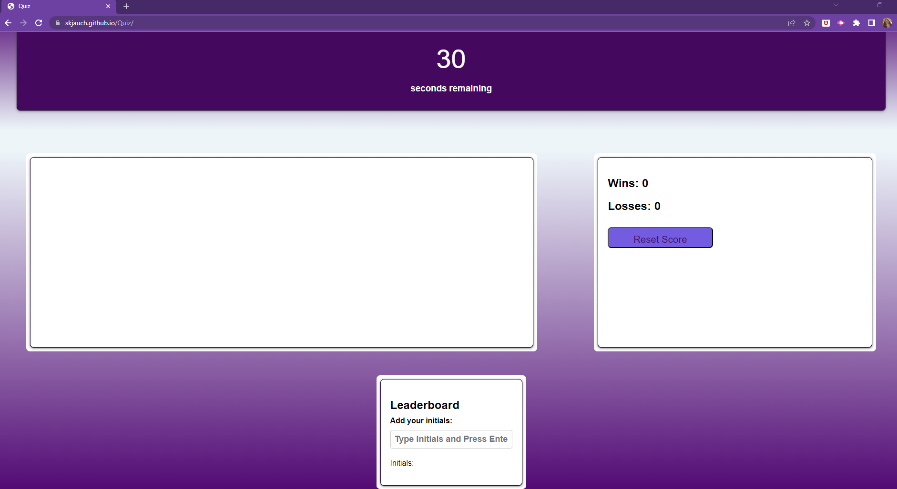

# Quiz

## Description

A multiple choice quiz for students learning JavaScript.  Upon clicking on the "Start" button, the timer will begin counting down from 30.  The user will then be presented with 3 mutiple choice questions.  If the user selects the incorrect answer, the use will be presented with the next question and 10 seconds will be taken off the time.  If the user is correct, the next question will appear.  The user is then able to save their initials and their score to the page.  The wins/losses will be tracked on the page and the user will be able to reset the wins/losses by clicking the "Reset Score" button.  

## GitHub

To view the GitHub repo, you can visit (https://github.com/SKJauch/Quiz)

## Deployed Link  

https://skjauch.github.io/Quiz/

## Screenshots  

  

